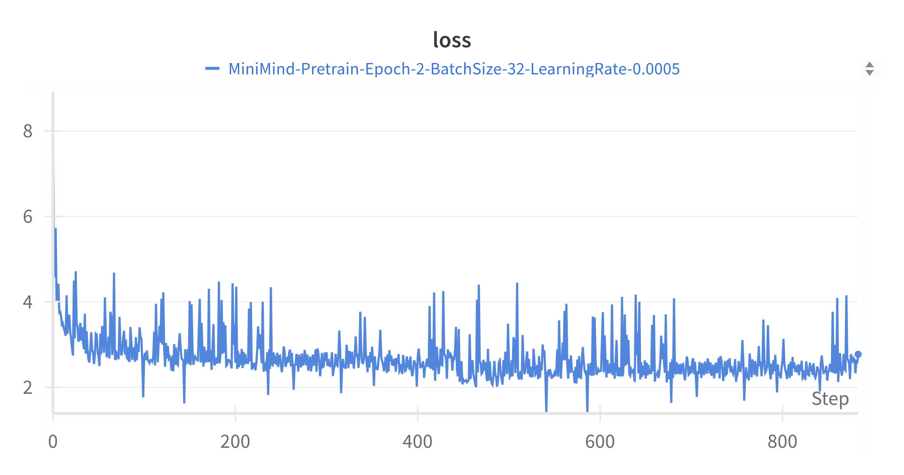
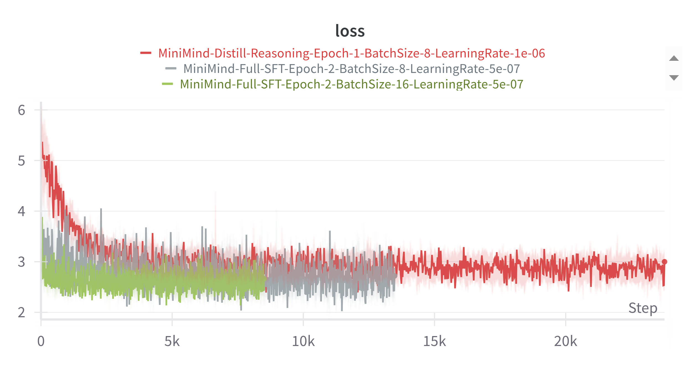
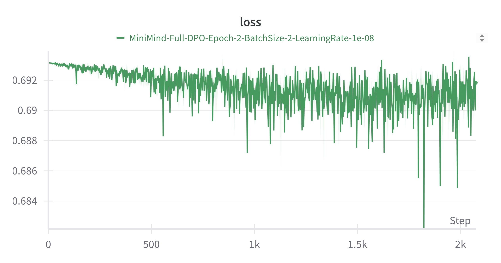

# Embformer: 一种仅使用嵌入权重的Transformer架构

**作者:** 吴何聪
**助手:** Gemini 2.5 Pro
**版本:** 1.0
**日期:** 2025-06-25

## 摘要

大型语言模型（LLMs）的计算和内存需求巨大，其部分原因是线性层中的密集矩阵乘法，这给模型的训练和部署带来了重大挑战。本研究纪要介绍了一种名为 **Embformer** 的新型Transformer架构，它彻底重构了模型的参数化方式。Embformer 将所有的线性投影层（用于查询、键、值和前馈网络）替换为直接从可训练的嵌入表中进行查找。这种设计将模型的核心操作从计算密集型转变为高效的内存检索型。我们首先提供了一个数学上的概念验证，证明了线性层可以等效地表示为一个缩放点积注意力机制，从而为我们从模型架构中移除线性层的决策提供了理论支持。基于这一洞见，我们设计并实现了一个Embformer模型，其所有权重都存储在与词元（token）相关的嵌入层中。一项包含16个层的初步实验证实了该架构的可行性；模型可以被成功训练并执行推理。然而，其性能目前落后于同等参数规模的传统Transformer，我们认为这是由于其参数在任何单次前向传播中被稀疏激活所致。这项工作为LLM架构提出了一种新的范式，即以内存查找换取计算密度，并概述了关键挑战与未来方向，包括优化注意力机制和管理训练过程中的嵌入内存。代码已在 [https://github.com/HighCWu/embformer](https://github.com/HighCWu/embformer) 开源。

## 1. 引言

基于Transformer的大型语言模型（LLMs）的巨大成功（Vaswani et al., 2017）与其庞大的模型规模密不可分。然而，这种规模也带来了代价：巨大的参数量主要集中在线性层中，导致了高昂的计算开销（以矩阵-矩阵乘法为主）和训练、推理过程中的高显存（VRAM）消耗。

近期的研究探索了减轻这些成本的创新方法。例如，RWKV的**DeepEmbed**（Peng, 2025）在前馈网络（FFN）中引入了逐层、逐词元的可训练向量。这些向量作为每个词元的逐通道缩放因子，可以在推理时被卸载到较慢的内存（RAM/SSD）中，从而显著降低活跃的显存占用。同样，谷歌在Gemma 3n模型中采用的**逐层嵌入（Per-Layer Embeddings, PLE）**（Google, 2025）也遵循了类似的原则，显示出业界对混合内存-计算模型的兴趣。

这些方法揭示了一个充满希望的方向：我们能否将这种“查找优于计算”的理念推向其逻辑上的极致？本研究纪要通过提出**Embformer**架构来探讨这个问题。Embformer完全用嵌入查找取代了线性层。我们的核心假设是，线性投影的功能可以通过从大型但高效的嵌入表中检索预先训练好的、与词元相关的向量来完成。

本纪要做出以下贡献：
1.  通过数学和代码证明，线性层操作可以被重构为一种注意力机制。
2.  设计了Embformer架构，其所有的查询、键、值向量以及前馈网络参数均直接来源于嵌入层。
3.  通过快速实验验证了该架构，证实了其可行性并描绘了其性能上的权衡。

## 2. 方法论

### 2.1. 理论基础：将线性层重构为注意力机制

Embformer的基础性见解在于，一个线性层操作 `y = x @ W^T` 在数学上可以被重构为一种特殊形式的注意力。这种等价性使我们能够用注意力块这一结构原语来替代矩阵乘法这一计算原语。

让我们考虑一个大小为 `in_features` 的输入向量 `x` 和一个大小为 `(out_features, in_features)` 的线性层权重矩阵 `W`。输出 `y` 的大小为 `out_features`。我们可以将此过程表述为一个注意力操作，其中输入 `x` 定义了注意力权重（`attn_weights`），而线性层的权重 `W` 扮演了值矩阵（`v`）的角色。在这种视角下，注意力机制的序列长度等价于输入特征维度（`in_features`）。

以下使用PyTorch的Python代码展示了这种等价性。

```python
import torch
import torch.nn as nn
import torch.nn.functional as F
import math

# 为可复现性设置随机种子
torch.manual_seed(42)

# --- 步骤 1: 计算一个标准线性层的结果 ---
x = torch.randn(4, 8)  # 批量大小=4, 输入特征=8
fc_weight = torch.randn(32, 8)  # 输出特征=32, 输入特征=8
y_linear = x @ fc_weight.T

# --- 步骤 2: 将其重构为注意力操作 ---
# 输入 `x` 决定了注意力权重。我们使用其绝对值进行归一化，
# 以形成一个概率分布。符号和总幅度被融入到值 `v` 中。
x_abs = x.abs()
x_sum = x_abs.sum(dim=-1, keepdim=True)
attn_weights = (x_abs / x_sum)[:, None]  # (bsz, 1, seq_len)，其中 seq_len=in_features

# 线性层权重 `fc_weight` 成为值 `v` 的基础。
# 输入 `x` 的幅度和符号被用来缩放 `v`。
v = fc_weight.T[None] * (x_sum[..., None] * x.sign()[..., None])
# v 的形状: (bsz, seq_len, out_dim) -> (4, 8, 32)

# 注意力输出通过 attn_weights 和 v 的乘积计算得出。
y_attention_manual = (attn_weights @ v)[:, 0]

# 验证：结果完全相同。
assert torch.allclose(y_attention_manual, y_linear)

# --- 步骤 3: 为标准注意力函数恢复 Q 和 K ---
# 我们可以反向工程出一对有效的 (q, k)，使其在 softmax 操作后能产生我们的 `attn_weights`。
# 这并非唯一解，但证明了其兼容性。

# 从我们期望的注意力权重出发，推导出 softmax 前的 logits。
# 我们加上一个随机常数以表明 softmax 是平移不变的。
logits = torch.log(attn_weights)
logits = logits - torch.randn(1)

# 验证 softmax(logits) 能恢复我们的注意力权重。
assert torch.allclose(torch.softmax(logits, dim=-1), attn_weights)

# 现在，我们可以将缩放后的 logits `s = logits * sqrt(d_k)` 分解为 `q @ k^T`。
# 我们选择一个随机的 k，然后求解 q = s @ inv(k^T)。
d_k = 8
s = logits * math.sqrt(d_k)
k = torch.randn(4, 8, d_k) # bsz, seq_len, d_k
k_inv_t = torch.linalg.inv(k.transpose(-2, -1))
q = s @ k_inv_t

# --- 步骤 4: 使用 F.scaled_dot_product_attention 进行最终验证 ---
# 使用恢复的 q、k 和我们构造的 v，我们可以用标准的PyTorch注意力函数得到最终结果。
y_sdpa = F.scaled_dot_product_attention(q, k, v)[:, 0]

# 最终输出与原始线性层输出匹配，证实了等价性。
assert torch.allclose(y_sdpa, y_linear, atol=1e-3)
```

这种等价性虽然在我们的最终模型中不需要显式地恢复 `q` 和 `k`，但它为用一个注意力块来替代线性层提供了理论依据。这个注意力块的值矩阵（value matrix）源自原线性层的权重，而其注意力模式由输入 `x` 决定。

### 2.2. Embformer 架构

Embformer 架构基于上述原则，系统性地将所有线性层替换为用于输入注意力机制或执行直接缩放的嵌入查找。

**设计灵感来源:** 我们的设计受到两个关键发现的启发：
1.  **分层的知识存储 (DeepEmbed, PLE):** 将与词元相关的知识存储在大型、逐层的嵌入表中的想法，对于提升模型表达能力和推理效率而言非常强大。
2.  **顶层信息集中 (Wu & Tu, 2024):** 研究表明，Transformer顶层的键值（KV）缓存包含了生成任务最关键的信息。这表明，将参数化的重点放在这些表征上是值得的策略。由于顶层的KV表征与原始输入嵌入密切相关，直接用嵌入输出替代它们变得可行。然而，我们认识到移除线性层会严重限制模型的表达能力，因此我们保留了跨层使用不同KV的设计（如同传统Transformer），但其值完全来源于不同的嵌入层输出。

**架构设计:**
*   **移除线性层:** 标准Transformer块中用于查询（Q）、键（K）、值（V）投影以及前馈网络（FFN）的所有 `nn.Linear` 层被完全移除。
*   **基于嵌入的投影:**
    *   **最顶层注意力层**的**查询向量**直接从一个专用的嵌入表中检索：`Q_top = Embedding_Q_top[token_id]`。
    *   **所有层**的**键和值向量**均来源于不同的、层特定的嵌入表：`K_layer_i = Embedding_K_i[token_id]` 和 `V_layer_i = Embedding_V_i[token_id]`。这保持了层间的表征多样性，对模型容量至关重要。
*   **基于嵌入的前馈网络:** 传统的前馈网络（通常是两层MLP）被替换为类似DeepEmbed的逐通道缩放操作。多头注意力块的输出与从一个层特定的FFN嵌入表中检索出的向量进行逐元素相乘：`FFN_output = Attention_output * Embedding_FFN_i[token_id]`。
*   **通道混合:** 由于移除了线性层，信息在注意力头之间以及FFN通道内部混合的机制也不复存在。因此，我们在缩放操作后引入了一个简单的、无参数的通道混合机制，以促进部分信息交换。
*   **参数绑定:** 用于词元预测的最终 `lm_head` 与初始输入嵌入层的权重进行绑定，这意味着模型中唯一的线性层（指lm_head）的权重也来自于嵌入层。

最终得到的模型，其所有可训练参数都存放在 `nn.Embedding` 层中。

## 3. 快速实验

为了验证 Embformer 概念的可行性，我们进行了一次初步的训练实验。

### 3.1. 实验设置

*   **基础代码:** 我们修改了 Hugging Face `transformers` 库中的 Qwen3 模型实现。
*   **训练框架:** 我们使用了 [MiniMind](https://github.com/jingyaogong/minimind) 框架，该框架提供了一套完整的训练流程和相关数据集。
*   **模型配置:**
    *   层数: 16
    *   隐藏层大小: 768
*   **词汇表:** 本次初步实验的一个关键点是使用了一个仅有 **6,400个词元** 的小词汇表。这是一个务实的选择，旨在将众多嵌入层所带来的内存占用控制在我们的可用硬件能够承受的范围内。该架构的内存消耗与 `词汇表大小 * 层数 * 隐藏层大小` 成线性关系。

### 3.2. 结果与分析

<p align="center">
  
  
  
</p>


训练实验的结果符合我们的预期。Embformer模型能够成功训练，损失曲线呈现出清晰的学习趋势。最终的模型能够执行推理并生成连贯（尽管简单）的文本，证实了该架构在功能上是可行的。

然而，其性能**显著差于**具有相似配置（16层，768隐藏层大小）的传统Transformer模型。造成这种性能差距的主要原因是**参数的稀疏激活**。在标准Transformer中，线性层的密集权重矩阵在为每个词元进行计算时都被完全利用。而在Embformer中，对于任何一次给定的前向传播，只有与输入序列中特定词元相对应的嵌入向量被激活和使用。这意味着，尽管总参数量可能很大，但在任何单次预测中，只有模型“知识”的一小部分被激活和使用。该模型是参数丰富，但计算和激活稀疏。

## 4. 结论与未来工作

我们的研究表明，通过将所有线性层替换为基于嵌入的查找来构建一个类Transformer模型——Embformer，是完全可行的。这为一个新的架构范式建立了概念验证，该范式以稀疏的内存访问换取密集的计算。

当前的主要挑战是与传统模型相比的性能差距。我们确定了两个关键的未来工作方向，以弥合这一差距并释放该架构的潜力：

1.  **提升注意力效率:** 在 Embformer 中，缩放点积注意力操作成为了主要的计算瓶颈，因为它是少数保留下来的密集计算之一。通过增加模型深度或宽度来提升性能会加剧这一瓶颈。未来的工作应着重于集成更高效的注意力机制（例如，线性注意力、状态空间模型或基于核的方法），这些机制能更好地随序列长度和模型大小扩展。

2.  **管理训练时的内存:** 当前设计的内存占用与词汇表大小直接相关。要在标准大小的词汇表（例如32k-128k词元）上训练有效的模型，嵌入表的内存需求对于大多数训练环境来说是难以承受的。下一个关键步骤是探索并实现相关策略，在训练期间将嵌入权重卸载（offload）到CPU内存或SSD，可以借鉴类似DeepSpeed ZeRO-Offload的技术。由于该架构本质上是基于查找的，这种方法天然适配。

总而言之，Embformer为构建高效LLM提供了一个初露锋芒但充满希望的方向。尽管仍有重大挑战，其在计算和内存之间的独特权衡，为构建运行速度更快、更易于在资源受限的边缘设备上部署的模型提供了一条引人注目的路径。

## 5. 参考文献

- Gong, J. (2024). *MiniMind: Train a 26M-parameter GPT from scratch in just 2h*. GitHub repository. [https://github.com/jingyaogong/minimind](https://github.com/jingyaogong/minimind)
- Google. (2025). *Announcing Gemma 3n preview: powerful, efficient, mobile-first AI*. Google for Developers Blog. [https://developers.googleblog.com/en/introducing-gemma-3n/](https://developers.googleblog.com/en/introducing-gemma-3n/)
- Peng, B. (2025). *DeepEmbed Explanation*. [https://x.com/BlinkDL_AI/status/1926941496684519805](https://x.com/BlinkDL_AI/status/1926941496684519805) and RWKV Official Website. [https://www.rwkv.cn/news/read?id=20250527](https://www.rwkv.cn/news/read?id=20250527)
- Ren, J., Rajbhandari, S., Aminabadi, R. Y., Ruwase, O., Yang, S., Zhang, M., ... & He, Y. (2021). *ZeRO-Offload: Democratizing Billion-Scale Model Training*. arXiv preprint arXiv:2101.06840. [https://arxiv.org/abs/2101.06840](https://arxiv.org/abs/2101.06840)
- Vaswani, A., Shazeer, N., Parmar, N., Uszkoreit, J., Jones, L., Gomez, A. N., ... & Polosukhin, I. (2017). *Attention is all you need*. Advances in neural information processing systems, 30.
- Wolf, T., Debut, L., Sanh, V., Chaumond, J., Delangue, C., Moi, A., ... & Rush, A. M. (2020). *Transformers: State-of-the-Art Natural Language Processing*. In Proceedings of the 2020 Conference on Empirical Methods in Natural Language Processing: System Demonstrations (pp. 38-45).
- Wu, H., & Tu, K. (2024). *Layer-Condensed KV Cache for Efficient Inference of Large Language Models*. arXiv preprint arXiv:2405.10637. [https://arxiv.org/abs/2405.10637](https://arxiv.org/abs/2405.10637)
